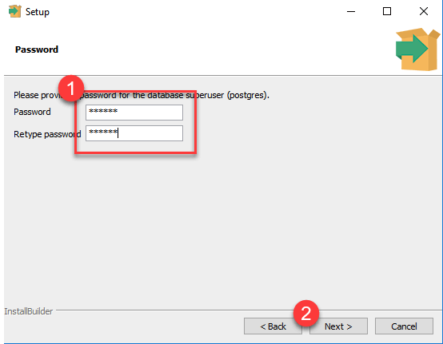

# Project 1 - Stock Master : Know stocks in your local currency    

## Project Context and Goals

## Project Goal

The aim of this project was to establish a comprehensive pipeline for extracting data from a live dataset that is constantly updating, and then loading it into a relational database to simulate a real-life data warehouse. The pipeline would encompass data transformations before loading (ETL) and after loading (ELT) to replicate potential data manipulation requirements for real-time applications.

The data must be formatted in a user-friendly manner to facilitate prompt engagement by data analysts (DA) and data scientists (DS) without necessitating substantial time allocation to data manipulations. This entails loading the data into distinct tables that can be seamlessly merged, featuring clear and intuitive column names and appropriate data types for each individual record.


## Business Objective

The primary objective of our project is to curate analytical datasets by leveraging the Market Stack API and Fixer API. These datasets will encompass a comprehensive range of stock data, including stock opening, high, low, closing, and volume metrics. Furthermore, we intend to amalgamate exchange data from the API to furnish investors with stock prices denominated in their respective local currencies.


## Consumers

Our data caters to the needs of local small investors and analysts from Australia, China, and India, enabling them to easily access stock prices in their local currency. It offers real-time information on stocks across global stock exchanges. Users can seamlessly retrieve data through SQL queries and custom SQL tables from the database, and leverage it to create visually engaging dashboards featuring maps and key performance metrics.

## Questions

What questions are you trying to answer with your data? How will data support our local small traders?

Example:

> - What is the price of a stock today or historically?
> - What is the price of stock in USD, Chinese yuan, Indian rupee, Australian dollar or Euro?
> - What is the average closing price of the stock in USD, Chinese yuan, Indian rupee, Australian dollar or Euro?


## Source datasets

What datasets are you sourcing from? How frequently are the source datasets updating?

- **Market Stack API**: MarketStack is a powerful API that provides real-time, intraday, and historical market data for global stock markets. It's widely used for accessing up-to-date stock price information in various formats.

- **Fixer API**: Fixer API is a popular service that provides real-time and historical exchange rate data for a wide range of currencies. It’s widely used for currency conversion applications.

- **Postgres**: Progress is used for storing store data from API, transformation of data and loading the results for traders to acess using SQL. Analyst can use the SQL to build a report/dashboard for analysis. 

**Table of contents for source data**

| Source name | Source type | Refresh Cadence | Link |
| - | - | - |- |
| Trader database | PostgreSQL database | Daily | - |
| Market Stack  | REST API | Daily | https://marketstack.com/ |
| Fixer API  | REST API | Hourly | https://fixer.io/ |

## Solution architecture

Below is the solution architecture description and diagram


- **Python** was used for:
  - Extracting the stock info and exchange rates, via two APIs.
  - Data transformation
  - Load data to our postgres database

- **PostgreSQL DBMS** was used for:
  - Storing all our data in both raw, serving & logging databases

- **AWS RDS** was used for:
  - Hosting and managing our postgres database.

- **SQL** was used for:
  - Data transformation 

- Other programs used:
  - **Docker** was used to containerize our pipeline
  - **ECR** was used to host our docker container
  - **ECS** was used to run the docker container
  - **S3** was used to store the `aws.env` file.


## Lessons Learned

- Understanding ETL/ELT Workflows
- Error Handling and Logging
- Docker Proficiency
- AWS Deployment


## Installation and Running Instructions

### 1. Install PostgreSQL and pgAdmin

Download PostgreSQL and pgAdmin by going to <https://www.postgresql.org/download/> and selecting the installer for your Operating System. Download PostgreSQL version 15.

After downloading the installer, run the installer on your computer.

Select all options for when promoted for the components you wish to install.


Enter a password:



Enter a port number. Note: The default port number `5432` is usually used when using PostgreSQL.

When installed successfully, you should be able to find `pgAdmin 4` in your applications.


### 2. Clone Repository

Clone this github repository.

### 3. Get App Token

In order to execute the pipeline, two separate App Tokens are needed to send requests through the respective APIs. </br>
To obtain the App Tokens, please follow these two links: </br>
[fixer.io](https://fixer.io/)   </br>
[marketstack.com](https://marketstack.com/)

### 4. Create .env file

Create the respective `.env` files following the template in the `template.env` file. </br>
For instance, in order to run the pipeline locally, create the .env file:

```py
MARKET_STACK_ACCESS_KEY="<market_stack_api_key>"
FIXER_ACCESS_KEY="<fixer_api_key>"

SERVER_NAME="localhost"
DATABASE_NAME="raw"
DB_USERNAME="<db-username>"
DB_PASSWORD="<db-password>"
PORT=5432

LOGGING_SERVER_NAME="localhost"
LOGGING_DATABASE_NAME="logging"
LOGGING_USERNAME="<db-username>"
LOGGING_PASSWORD="<db-password>"
LOGGING_PORT=5432

TARGET_SERVER_NAME="localhost"
TARGET_DATABASE_NAME="serving"
TARGET_DB_USERNAME="<db-username>"
TARGET_DB_PASSWORD="<db-password>"
TARGET_PORT=5432
```

### 5. Set up virtual environment

To set up a python virtual environment using conda, you will first need to have conda installed. If you don't have conda installed, please [anaconda installation](https://docs.anaconda.com/anaconda/install/).

(a). Open terminal or command prompt.

(b). Notice the `(base)` conda environment has already been activated.

(c). Create a new conda environment

```
conda create -n <your_conda_env_name> python=3.9
```

(d). Activate the new conda environment

```
conda activate <your_conda_env_name>
```

Notice the conda environment has switched to your environment e.g. `(py-etl)`.

(e). Install required libraries.

```
pip install -r requirements.txt  
```

(f). Check that the libraries have been installed.

```
pip list # prints out all the libraries installed in your activated environment.
```

### 6. Run pipeline

Once the .env file is created with the relevant App Tokens and database information, the pipeline can be ran using python. Assuming python is installed on your system, type the following command into the terminal from the directory:

```bash
python -m etl_project.pipelines.run
```


