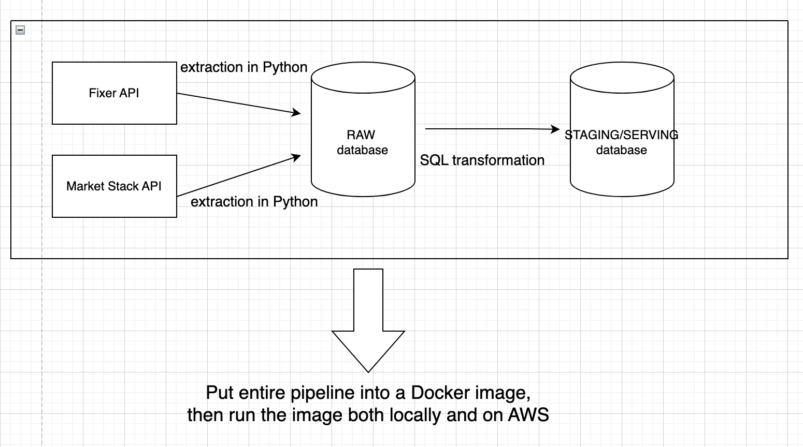

# Project plan

## Objective

A short statement about the objective of your project.

> The objective of our project is to provide analytical datasets from our MarketStack API and Fixer Foreign Exchange API to provide value to end users.

## Consumers

What users would find your data useful? How do they want to access the data?

> The users of our datasets are financial analysts and traders from different countries around the world. They can find stock prices in their home currency and access the data via our production ProsgreSQL database.

## Questions

What questions are you trying to answer with your data? How will your data support your users?

> - What is the price of a stock?
> - What is the price of a stock in his/her home currency?
> - Our transformed datasets build a Stock profile in different currencies.

## Source datasets

What datasets are you sourcing from? How frequently are the source datasets updating?

| Source name | Source type | Refresh Cadence | Link |
| - | - | - |- |
| Market Stack API | REST API | Daily | https://marketstack.com/ |
| Fixer API | REST API | Hourly | https://fixer.io/ |

## Solution architecture

 