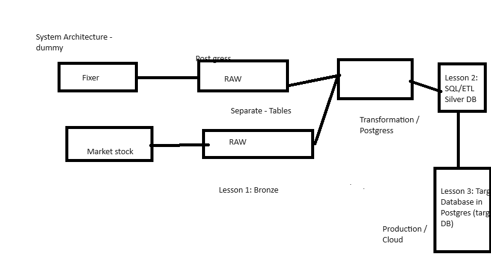

# Project plan

## Objective

A short statement about the objective of your project.

Example:

> The objective of our project is to provide analytical datasets from our Market Stack API and Fixer for currency exchange.

## Consumers

What users would find your data useful? How do they want to access the data?

Example:

> The users of our datasets are Traders from around the world to find stock prices and home currency estimator for the traders.

## Questions

What questions are you trying to answer with your data? How will your data support your users?

Example:

> - What is the price of a stock?
> - What is the home currency of the stock?
> - Build Stock profile for Traders in home cuurecy?

## Source datasets

What datasets are you sourcing from? How frequently are the source datasets updating?

Example:

| Source name | Source type | Source documentation | Link |
| - | - | - |- |
| Customers database | PostgreSQL database | - | - |
| Market Stack  | REST API | Daily |- |
| Fixer API  | REST API | Hourly |- |

## Solution architecture

Here is a dummy  solution architecture diagram:

How are we going to get data flowing from source to serving? What components and services will we combine to implement the solution? How do we automate the entire running of the solution?

- What data extraction patterns are you going to be using?
- What data loading patterns are you going to be using?
- What data transformation patterns are you going to be performing?

We recommend using a diagramming tool like [draw.io](https://draw.io/) to create your architecture diagram.

## Breakdown of tasks

Based on team recommndation, we would use slack for task and communications for intermediate. In case, we need specfic tasks we might think of Trello.
